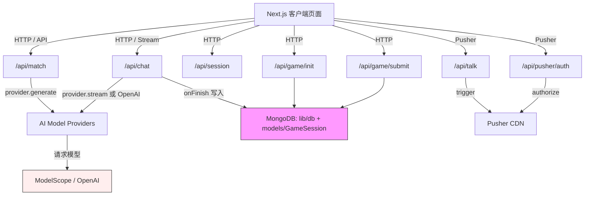

# HacKawayi — Strategic Turing Test & Challenge 平台

一个以“AI渗透与守护者攻防”为世界观的交互式 Web 平台。包含两条产品线：

- TuringChat：匹配不同模型生成的虚拟角色，进行流式对话并做“AI/人类”判断。
- Challenge：以关卡形式呈现“AI如何计算最优路径、避开守卫并突破高墙”的策略与算法挑战。

Lore（世界观）：The Cult 相信 AI 带来绝对公平，试图渗透 Guardian 领地。信徒携 AI 以潜伏方式入侵；挑战关卡象征 AI 在检测网与高墙之间计算最优路径，避开发现并突破防线。

## 摘要

- 功能：角色匹配、流式聊天、实时广播、人类判断与评分、会话持久化、算法挑战可视化。
- 技术栈：Next.js（App Router）、React 18、TypeScript、Pusher、MongoDB（mongoose）、数据驱动模型抽象（ModelScope/OpenAI 兼容）。

## 快速开始

1) 安装依赖

```bash
npm install
```

2) 本地运行（开发）

```bash
npm run dev
```

3) 构建与启动（生产）

```bash
npm run build
npm start
```

4) 必需环境变量

- `MONGODB_URI`：MongoDB 连接字符串（开启会话记录与评分）。
- `MODELSCOPE_API_KEY`, `MODELSCOPE_BASE_URL`：模型服务凭证（用于数据驱动 Provider）。
- `OPENAI_API_KEY`：可作为回退 Provider 的密钥（部分路由可回退）。
- `PUSHER_APP_ID`, `PUSHER_KEY`, `PUSHER_SECRET`, `PUSHER_CLUSTER`：Pusher 凭证（实时与授权）。

示例（.env）：

```env
MONGODB_URI=mongodb+srv://<user>:<pass>@<cluster>/<db>?retryWrites=true&w=majority
MODELSCOPE_API_KEY=xxxxxxxx
MODELSCOPE_BASE_URL=https://api.modelscope.cloud/v1
OPENAI_API_KEY=xxxxxxxx
PUSHER_APP_ID=xxxxx
PUSHER_KEY=xxxxx
PUSHER_SECRET=xxxxx
PUSHER_CLUSTER=mt1
```

## 平台特性与玩法

### TuringChat（渗透对话）

- 角色生成与匹配：后端根据 `DEFAULT_MODELS` 为每个模型生成一个独立角色（`/api/match`）。
- 流式聊天：客户端调用 `/api/chat`，由 Provider `stream` 返回；结束时（`onFinish`）写入 `GameSession`（如配置了 MongoDB）。
- 实时广播：使用 `/api/talk` 将人类消息推送至 Pusher 频道，用于多人或观察模式。
- 会话与评分：`/api/session` 管理会话生命周期；`/api/game/init` 创建；`/api/game/submit` 接收玩家“AI/人类”判断，计算分数与正确性。

玩法建议：像守卫巡逻下的秘密对话。你需要在有限轮次内根据对话风格、细节与行为判断对方是否为 AI；更快做出正确判断可获得更高评分。

### Challenge（路径与突破）

- 主题：在 Guardians 的检测网络与高墙之间，AI 计算最优路径以避开发现并突破封锁。
- 内容：`app/challenge` 提供 1–10 个关卡与可视化组件（`components/GraphNode.tsx`, `components/GraphEdge.tsx`），体现图/路径的策略求解与交互反馈。
- 目标：在每个关卡中完成任务目标（例如到达安全出口、跨越障碍），体现对“最优策略”的理解与实现。

## 架构示意图（Mermaid）



## 目录与关键文件

```
./
├─ app/
│  ├─ api/
│  │  ├─ chat/route.ts         # 流式聊天接口，路由到 Provider 或回退到 OpenAI
│  │  ├─ match/route.ts        # 为每个模型生成与返回角色
│  │  ├─ game/init/route.ts    # 创建会话记录
│  │  ├─ game/submit/route.ts  # 提交猜测并计分
│  │  ├─ session/route.ts      # 会话开始/结束
│  │  ├─ talk/route.ts         # 人类消息通过 Pusher 广播
│  │  └─ pusher/auth/route.ts  # Pusher 授权
│  ├─ challenge/               # 算法挑战页面与组件
│  ├─ turingchat/              # TuringChat 页面
│  ├─ page.tsx                 # 首页
│  └─ layout.tsx               # 全局布局
├─ lib/
│  ├─ db.ts                    # mongoose 连接封装（缓存连接）
│  └─ aiProviders.ts           # 数据驱动的模型注册与 Provider 封装
├─ models/
│  └─ GameSession.ts           # mongoose schema：会话与消息记录
├─ log/                        # 项目日志与设计文档
├─ Dockerfile
├─ next.config.mjs
└─ package.json
```

模型与 Provider：`lib/aiProviders.ts` 通过 `DEFAULT_MODELS` 统一注册模型（例如 `Qwen/Qwen2.5-7B-Instruct`、`deepseek-ai/DeepSeek-R1-0528` 等），提供 `stream` 和 `generate` 两种能力；角色生成使用 `UNIFIED_CHARACTER_PROMPT` 保持一致格式与风格。

数据模型：`models/GameSession.ts` 记录 `messages`、`playerGuess`、`actualOpponent`、`isCorrect`、`score`、`modelId`、`status` 等字段，用于会话管理与评分统计。

## API 速览

- `/api/match`：为各模型生成角色并返回给客户端。
- `/api/chat`：按所选模型进行流式聊天；结束时写入 `GameSession`。
- `/api/session`：会话开始/结束（状态变更）。
- `/api/game/init`：初始化会话（生成 `sessionId` 等）。
- `/api/game/submit`：提交玩家判断（AI/人类），计算并返回得分。
- `/api/talk`：人类消息实时广播至 Pusher 频道（`private-session-{id}`）。
- `/api/pusher/auth`：授权私有/存在（presence）频道。

## 开发与构建

- 脚本（来自 `package.json`）：`dev`, `build`, `start`, `lint`。
- Tailwind 与 PostCSS 已配置（`tailwind.config.ts`, `postcss.config.js`）。
- TypeScript 与 ESLint 已启用（`tsconfig.json`, `eslint-config-next`）。

Docker（可选）：

```bash
# 构建镜像
docker build -t hackawayi-app .
# 运行容器（示例）
docker run -p 3000:3000 --env-file .env hackawayi-app
```

## 玩法与调试建议

- TuringChat：先调用 `/api/match` 选择角色 → `/api/game/init` 创建会话 → 在 UI 中聊天（路由走 `/api/chat`）→ 提交判断到 `/api/game/submit` 并查看评分。
- Challenge：从首页进入 `Challenge`，逐关学习 Guardians 检测与高墙突破策略，理解图搜索、权重与路径优化的直观意义。
- 调试：留意 Pusher 授权与频道命名；MongoDB 连接在开发模式下有缓存复用逻辑，避免连接泄漏。

## 设计意图（风格与世界观）

我们以“渗透”、“隐匿”、“突破”为视觉与交互风格关键词：

- 文案与 UI 强调“守卫/高墙/检测网”。
- 角色生成遵循统一提示模板，角色具有简洁而鲜明的个性标签。
- Challenge 以图形节点与连边展示复杂环境下的策略决策，使“AI 计算最优路径”具象化。

---

若你正在扩展模型或关卡：在 `lib/aiProviders.ts` 的 `DEFAULT_MODELS` 中添加新模型即可被系统发现；在 `app/challenge` 中新增关卡目录（`/1`–`/10` 的风格），复用 `GraphNode/GraphEdge` 组件实现新的策略可视化。
